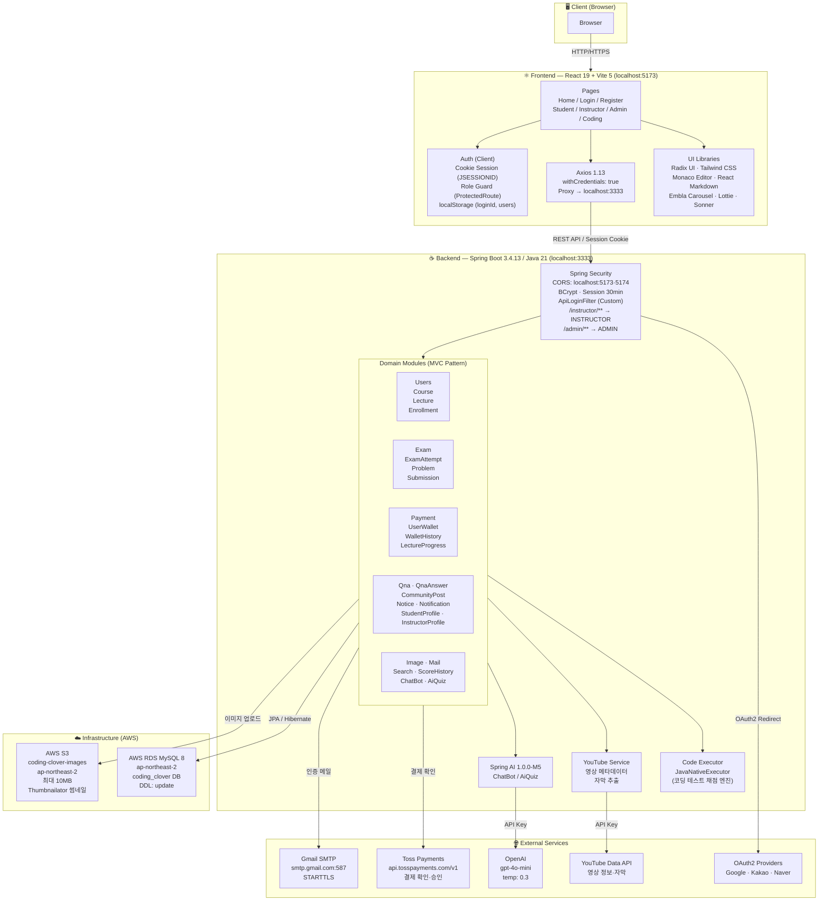
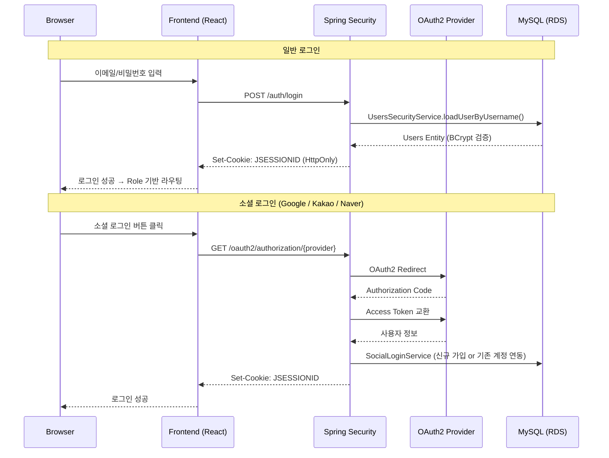
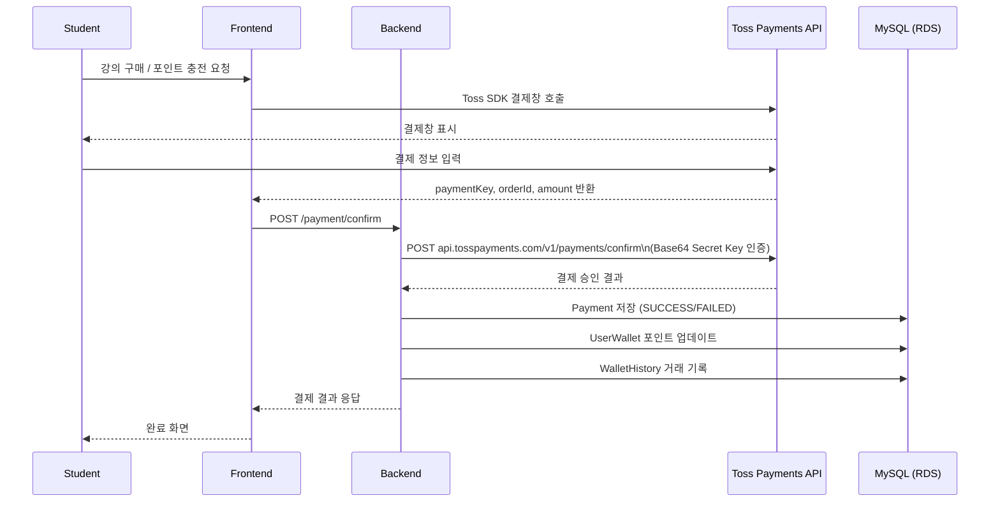
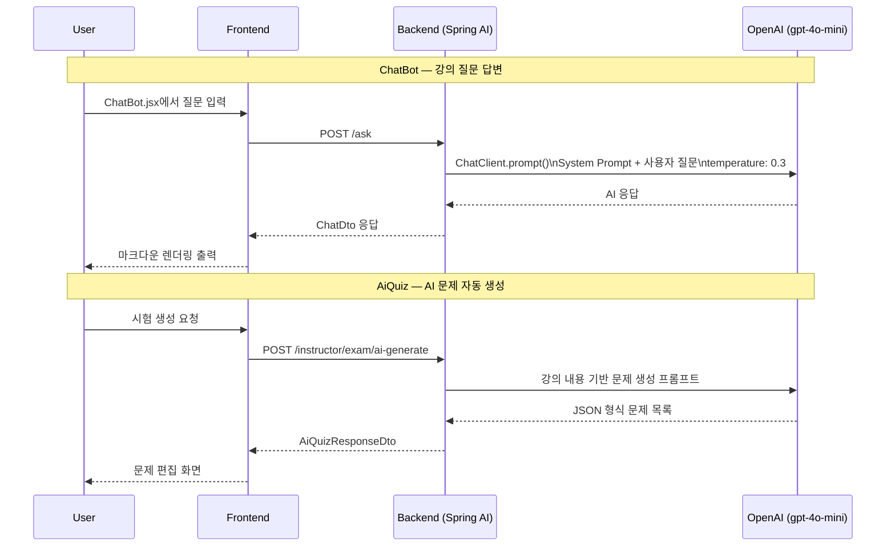
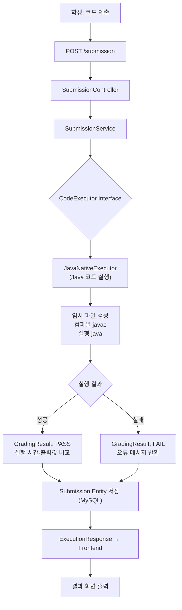
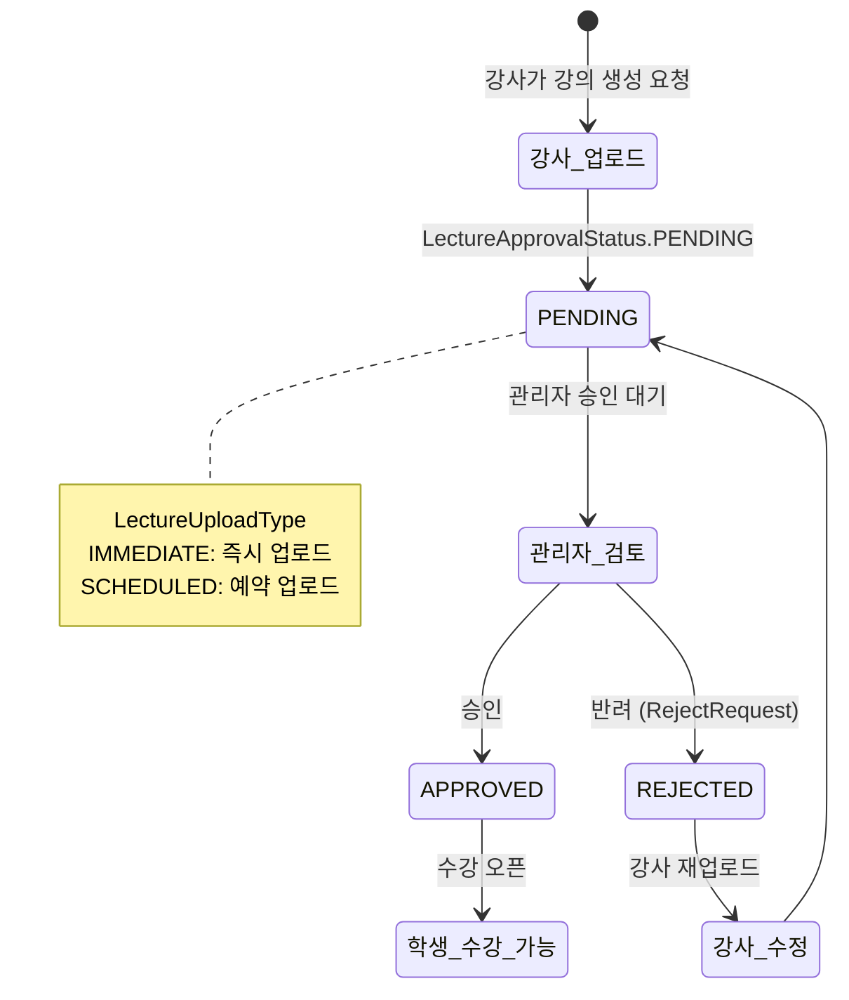
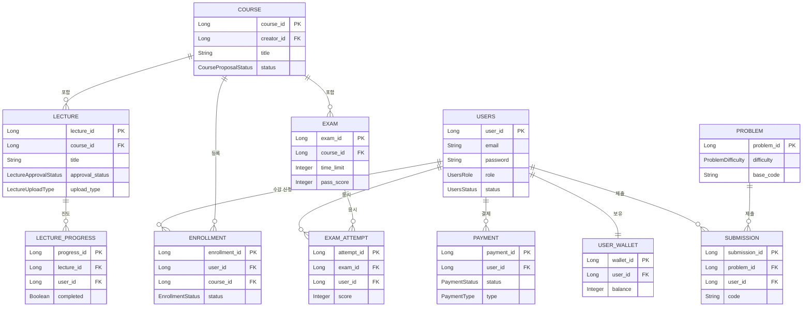
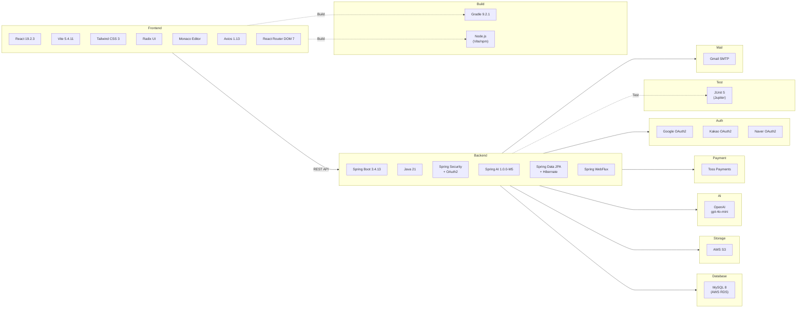

# Coding Clover

Java 기반 온라인 코딩 교육 플랫폼. 강의 수강, 시험, 코딩 테스트, AI 챗봇, 결제 기능을 통합 제공합니다.

---

## 전체 시스템 아키텍처



---

## 인증 흐름



---

## 결제 흐름



---

## AI 기능 흐름



---

## 코딩 테스트 채점 흐름



---

## 강의 업로드 워크플로우



---

## DB 주요 엔티티 관계



---

## 기술 스택 요약



---

## 환경 구성

| 항목 | 개발 환경 | 비고 |
|------|-----------|------|
| Backend Port | `3333` | Spring Boot |
| Frontend Port | `5173` | Vite Dev Server |
| Vite Proxy | `/auth`, `/api`, `/course`, `/student`, `/instructor`, `/admin`, `/notice`, `/ask` | → localhost:3333 |
| DB | AWS RDS MySQL (ap-northeast-2) | `coding_clover` |
| Storage | AWS S3 `coding-clover-images` | ap-northeast-2 |
| AI | OpenAI gpt-4o-mini | temperature: 0.3 |
| 결제 | Toss Payments (테스트 키) | `test_sk_...` |
| 메일 | Gmail SMTP (:587, STARTTLS) | |
| 소셜 로그인 | Google / Kakao / Naver | OAuth2 |
| 파일 크기 제한 | 10MB | Multipart |
| 세션 만료 | 30분 | JSESSIONID (HttpOnly) |

### 환경변수 (.env)

```
OPENAI_API_KEY      # OpenAI API 인증
AWS_ACCESS_KEY      # AWS S3 접근 키
AWS_SECRET_KEY      # AWS S3 시크릿 키
AWS_S3_BUCKET       # coding-clover-images
```

---

## 프로젝트 구조

```
codingclover/
├── src/
│   ├── main/
│   │   ├── java/com/mysite/clover/
│   │   │   ├── Users/          # 사용자 인증·관리
│   │   │   ├── Course/         # 강의 과정 관리
│   │   │   ├── Lecture/        # 강의 영상 관리
│   │   │   ├── Enrollment/     # 수강 신청
│   │   │   ├── Exam/           # 시험 관리
│   │   │   ├── ExamAttempt/    # 시험 응시 기록
│   │   │   ├── Problem/        # 코딩 문제
│   │   │   ├── Submission/     # 코드 제출·채점
│   │   │   ├── Payment/        # 결제 (Toss)
│   │   │   ├── UserWallet/     # 포인트 지갑
│   │   │   ├── WalletHistory/  # 거래 내역
│   │   │   ├── LectureProgress/# 강의 진도
│   │   │   ├── Qna/            # Q&A
│   │   │   ├── QnaAnswer/      # Q&A 답변
│   │   │   ├── CommunityPost/  # 커뮤니티 게시판
│   │   │   ├── Notice/         # 공지사항
│   │   │   ├── Notification/   # 알림
│   │   │   ├── ScoreHistory/   # 성적 이력
│   │   │   ├── StudentProfile/ # 학생 프로필
│   │   │   ├── InstructorProfile/ # 강사 프로필
│   │   │   ├── Image/          # 이미지 업로드 (S3)
│   │   │   ├── Mail/           # 이메일 서비스
│   │   │   ├── ChatBot/        # AI 챗봇
│   │   │   ├── AiQuiz/         # AI 문제 생성
│   │   │   ├── Search/         # 통합 검색
│   │   │   └── SecurityConfig.java
│   │   └── resources/
│   │       └── application.properties
│   └── test/
│       └── java/com/mysite/clover/   # JUnit 5
├── frontend/
│   ├── src/
│   │   ├── pages/              # 페이지 컴포넌트 (101+ JSX)
│   │   │   ├── student/
│   │   │   ├── instructor/
│   │   │   ├── admin/
│   │   │   ├── coding/
│   │   │   └── public/
│   │   └── components/         # 공통 컴포넌트
│   │       └── ui/             # Radix UI 래퍼
│   ├── package.json
│   └── vite.config.js
├── build.gradle
├── settings.gradle
└── .env
```
